# User guide

For someone who has never tracked an animal with software. It starts with what
the software does and ends with trajectories you can trust, and it says where
things go wrong as well as how they work.

If you already use idtracker.ai and only want what this fork adds, read
[README.md](README.md) and [docs/detectron2-pipeline.md](docs/detectron2-pipeline.md)
instead.

---

## Contents

1. [What this does](#1-what-this-does)
2. [Is this the right tool for you](#2-is-this-the-right-tool-for-you)
3. [Installing](#3-installing)
4. [A first run](#4-a-first-run)
5. [When thresholding is not enough](#5-when-thresholding-is-not-enough)
6. [Teaching it to see your animals](#6-teaching-it-to-see-your-animals)
7. [The GPU stages](#7-the-gpu-stages)
8. [Tracking with the contours](#8-tracking-with-the-contours)
9. [Checking the result](#9-checking-the-result)
10. [When something goes wrong](#10-when-something-goes-wrong)

---

## 1. What this does

You give it a video of several animals. It gives you back, for every frame, a
position for each animal — **and it keeps track of which one is which**.

That last part is the hard bit and the whole point. Following five moving
shapes is easy until two of them swim over each other; when they separate,
something has to decide which was which. Getting that wrong at one crossing
corrupts everything after it, so a tracker that cannot resolve crossings is not
much use for measuring individual behaviour.

idtracker.ai solves it by learning what each animal looks like. Five words
cover the whole pipeline:

| Term | What it means |
|---|---|
| **blob** | a patch of pixels in one frame that the software thinks is an animal |
| **crossing** | a moment when animals touch or overlap, so their blobs merge into one |
| **fragment** | a run of frames between crossings, where one animal is tracked continuously |
| **identity** | which real animal a fragment belongs to, worked out by a small neural network trained on your own video |
| **session** | one tracking job: the videos, the settings, and everything produced from them |

The chain runs: **video → blobs → fragments → identities → trajectories.**
Everything in this guide is about getting the first arrow right, because the
rest of the chain is only as good as the blobs it starts from.

This fork changes exactly one thing: **where the blobs come from.** Upstream
idtracker.ai finds them by brightness. This fork can instead take them from a
segmentation model you train on your own footage. Everything after the blobs —
crossings, fragments, the identification network — is upstream's, unmodified.

---

## 2. Is this the right tool for you

idtracker.ai suits video of **up to about 100 animals**, filmed from a fixed
camera, in a contained arena, where the animals stay visible. It is not a
general-purpose object tracker and it will not follow animals through
occlusion by scenery.

Before anything else, answer one question: **can you see every animal, in
every frame, with your own eyes?** If you cannot, no tracker will. Fix the
lighting or the camera first; it is cheaper than everything that follows.

Then decide which route you need:

| Your footage | Use |
|---|---|
| animals clearly darker or lighter than a fairly even background | **thresholding** — section 4, no GPU, no training, working in an afternoon |
| animals a similar brightness to the background, uneven lighting, turbid water, reflections | **the Detectron2 route** — sections 6 and 7, which costs you a few hundred hand-drawn outlines and a GPU |

Try thresholding first even if you expect it to fail. It takes twenty minutes
and it tells you what you are up against.

---

## 3. Installing

You need **Python 3.10 or newer**.

**Install PyTorch first, and not from plain PyPI.** idtracker.ai identifies
animals with a neural network, and PyPI's Windows PyTorch is a CPU-only build:
install it and your graphics card sits idle while tracking takes hours instead
of minutes. Get the right command for your machine from
[pytorch.org](https://pytorch.org/get-started/locally/) — it depends on whether
you have an NVIDIA card, an AMD card, an Apple M-series chip, or none — and run
that first. It will look something like this, but **do not copy this line**;
the URL differs per machine:

```bash
pip3 install torch torchvision --index-url https://download.pytorch.org/whl/...
```

Then this fork:

```bash
pip install git+https://github.com/mbel-tech/idtrackerai-detectron2.git
```

That brings LabelMe, which you will need for annotating in section 6. It does
**not** bring Detectron2 — that is only needed for training, it has no PyPI
release, and it builds from source. Leave it until section 7.

Check it worked:

```bash
idtrackerai
```

The Segmentation App should open.

> **This fork cannot share an environment with upstream idtracker.ai.** The
> import name is unchanged, so installing both breaks one of them. Use a fresh
> virtual environment or conda environment.

---

## 4. A first run

idtracker.ai ships two short example videos. Find them with:

```bash
python -c "import idtrackerai, pathlib; print(pathlib.Path(idtrackerai.__file__).parent / 'data')"
```

Open `idtrackerai`, click **Open...**, and choose `test_A.avi`.

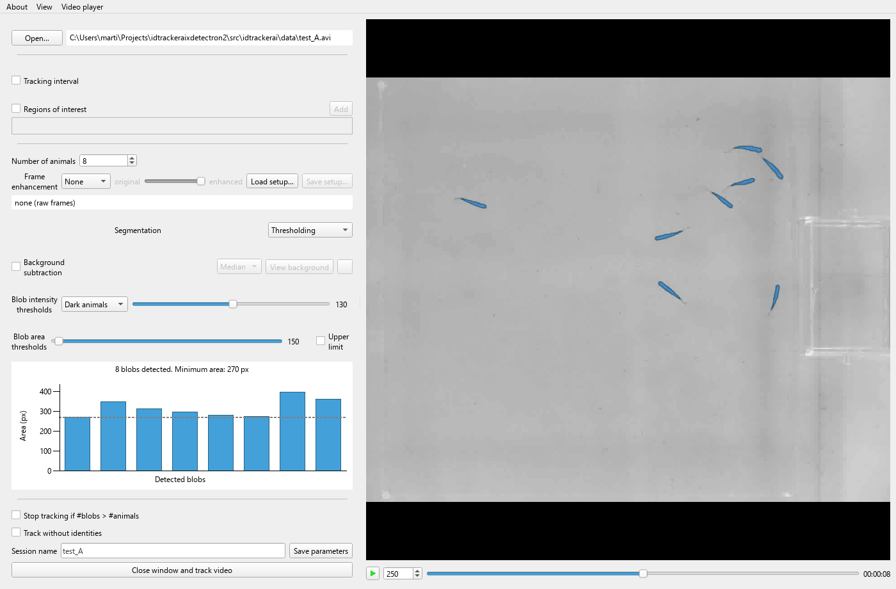

Four things to set, top to bottom:

1. **Number of animals** — eight, in this clip. The app uses it to tell you
   when it has found too many blobs.
2. **Blob intensity thresholds** — whether animals are darker or lighter than
   the background, and by how much. These fish are dark on a pale floor, so
   *Dark animals*.
3. **Blob area thresholds** — the smallest patch worth calling an animal.
   Raising it discards specks of noise; raise it too far and you discard
   animals.
4. Watch the line above the histogram. It says **8 blobs detected** and the
   bars are all a similar height, which is what success looks like: one blob
   per animal, all about the same size.

Then **Close window and track video**. Tracking runs in the terminal and
writes a session folder next to the video, with trajectories inside it.

That is the whole legacy workflow. Upstream documents every control in detail
in [the Segmentation App guide](docs/source/user_guide/segmentation_app.rst),
which is still accurate — this fork did not change thresholding, it only added
an alternative to it.

> **Ignore `docs/source/install/` and `docs/source/user_guide/validator.rst`.**
> Those pages describe upstream's installer and a Validator without the
> features this fork added. Use section 3 and [VALIDATOR.md](VALIDATOR.md).

---

## 5. When thresholding is not enough

Here is the same app on real footage: five fish in a tank, filmed from above
through the water, under uneven light with reflections on the surface.

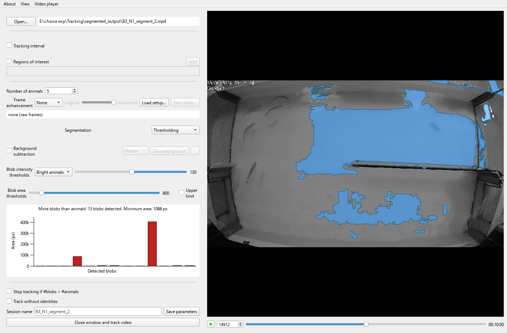

**Thresholding has found the reflections and missed every fish.** The fish are
the faint dark streaks in the upper left, untouched.

Compare the histogram with the one in section 4. There the bars were blue and
all about the same height, because eight similar animals make eight similar
blobs. Here they are red and range from a few hundred pixels to nearly four
hundred thousand. Nothing that varies by three orders of magnitude is a set of
fish.

**Switching to "Dark animals" does not rescue it.** The fish are darker than
the water, so that is the obvious next thing to try, and several settings do
produce exactly five blobs. They are the black bars above and below the frame
and the shadowed tank walls — single blobs of 150,000 to 360,000 pixels, next
to fish of about 2,000. Push the threshold past about 115 and the whole frame
merges into one blob instead.

Masking the borders off with a region of interest does not rescue it either.
Restricted to open water, the count swings between one and seven as the
threshold moves and never settles anywhere near five: there is no plateau to
find, because no single brightness separates a fish from the water it is in.

Two things here will mislead you, and both are worth knowing before you spend
a day tuning sliders.

**The blob count can be right for the wrong reason.** In the screenshot the
app catches the problem — *More blobs than animals!* — but that warning only
fires when there are too many. Tuned differently this same frame gives exactly
five blobs, matching the five fish, with no warning at all, and every one of
them is scenery. A blob count that agrees with your animal count is not
evidence the right things were found. Look at the picture.

**No amount of parameter tuning fixes this.** Thresholding asks one question,
"is this pixel brighter than X", and on this footage that question has no good
answer. Recognising an animal by its shape needs something that can ask a
different question, which is what the rest of this guide is about.

---

## 6. Teaching it to see your animals

Instead of asking about brightness, train a model to recognise your animals,
and feed its outlines to idtracker.ai in place of the thresholded ones.

Switch **Segmentation** to **Detectron2 pipeline**. A six-step panel appears.
The work splits in two: **steps 1 to 3 happen here, on your machine,** because
each one wants your eyes on the footage, while **steps 4 to 6 want a GPU** —
yours if you have one, Google Colab if not. Section 7 covers both.

### Step 1 — Enhancement

Enhancement evens out lighting and boosts local contrast. Drag the
**original ↔ enhanced** wipe to compare halves of the same frame:

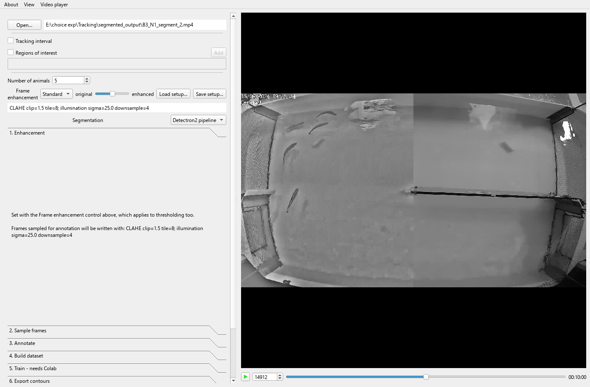

Pick the weakest setting that makes the animals stand out. Whatever you choose
is written beside the sampled frames and travels all the way to inference, so
the model is trained on, and later run on, the same kind of image. That
consistency matters more than the exact numbers.

> Enhancement applies to thresholding too, and it changes the brightness range
> your intensity thresholds were chosen against. Turn both on and the app says
> so, and tells you to watch the blob count while you re-tune them.

### Step 2 — Sample frames

This is where a *collection* comes in. A model should see every recording from
a setup, not just the clip you happen to be tracking, so this step keeps its
own list of videos.

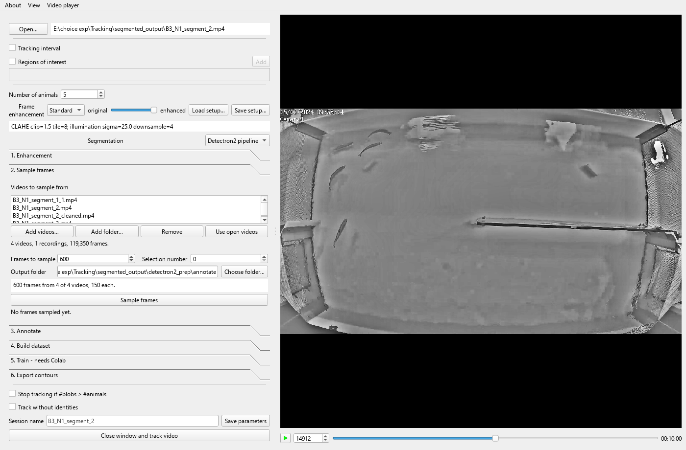

**Add folder...** takes every clip from a setup. The summary underneath counts
the videos, how many *recordings* they group into, and their total length.
Above the button, a line says what the run would do before it does it — how
many frames from how many clips, and the smallest and largest share. If it
warns that some clips would get no frames at all, raise the count: a clip with
no frames in the training set is a clip the model never learned.

A few hundred frames is usual.

### Step 3 — Annotate

**Open in LabelMe** launches the annotation tool on the sampled frames, with
your class name preloaded. Draw one polygon around each animal, in every
frame. It saves as you go, so you can stop and come back.

This is the slow part — budget an evening for a few hundred frames — and it is
the part that determines how good the model gets. Outline the animal, not its
shadow or its reflection.

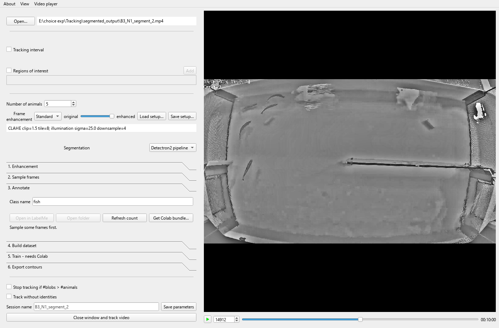

When the count reads that every frame is done, click **Get Colab bundle...**.
It writes `colab_bundle.zip` and tells you what else to put on Google Drive.

> Click **Save parameters** too. The notebook reads that file and carries your
> animal count, area thresholds, region of interest and tracking interval
> through to tracking, instead of you retyping them.

---

## 7. The GPU stages

Training a model and running it over every frame both want a GPU. You have two
routes, and they do the same work.

### Here, if you have an NVIDIA card

Steps 4 to 6 of the panel run the same stages on your own machine. Step 5
checks first and renames itself to say what it found:

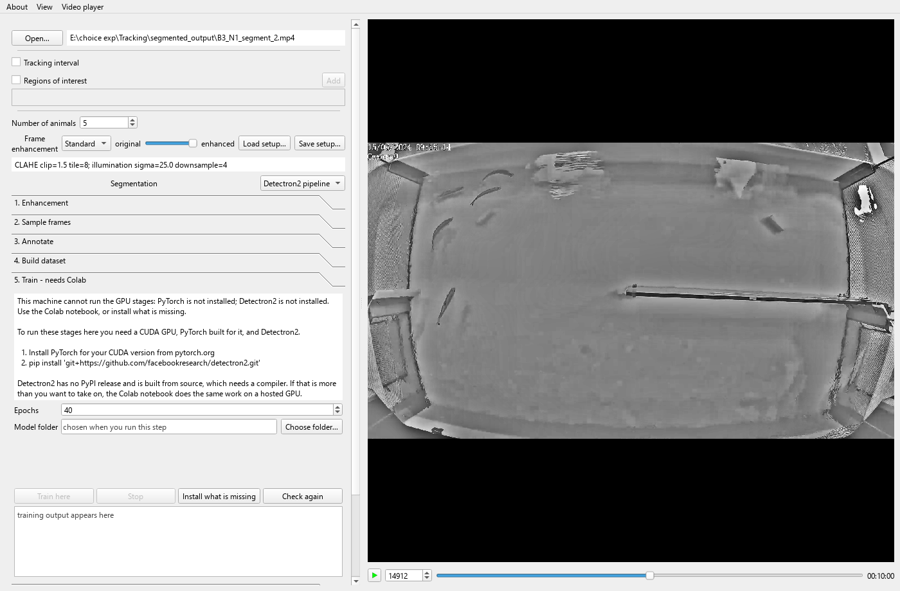

That is the machine these screenshots were taken on, which has no CUDA card.
When a step cannot run here it says so plainly, names what is missing, and
gives you both ways forward: **Install what is missing** runs the right
commands for your machine, **Check again** re-tests after you have, and the
Colab notebook does the same work on a hosted GPU if you would rather not
build Detectron2 from source.

Step 4 builds the dataset, and it reports what it is about to do before doing
it:

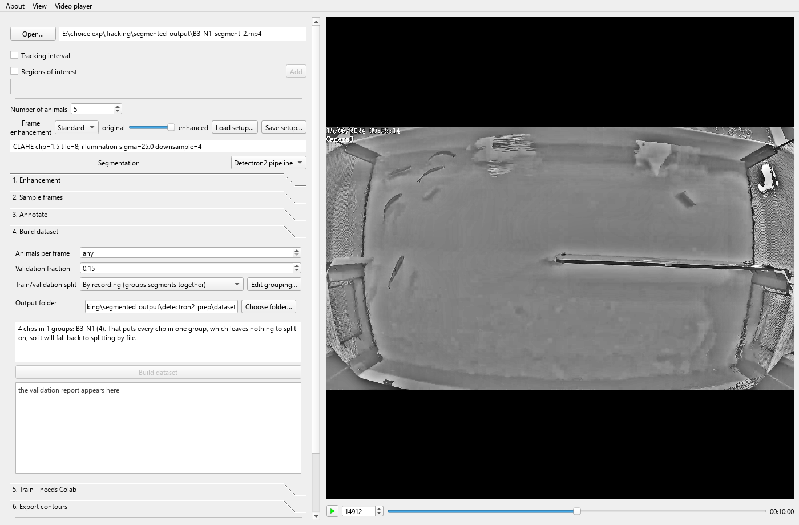

**The train/validation split is by recording, not by frame.** Clips that are
pieces of one recording go to the same side, because they show the same
animals minutes apart — train on one and test on the other and you measure
memory, not skill. The app infers the grouping from filenames and prints it.

Read that box. In the picture it says all four clips fell into one group, so
there is nothing to split on and it will fall back to splitting by file — the
honest outcome for four segments of a single recording, and a sign you want
footage from more than one recording before trusting the validation score.

Skip to section 8 once the export has finished.

### Or in Colab, if you do not

Upload to one folder on Drive: the bundle, your annotated frames folder, and
the parameters file. Your videos go on Drive as well — anywhere, the notebook
asks where. Then open `colab_detectron2_pipeline.ipynb` from inside the zip.

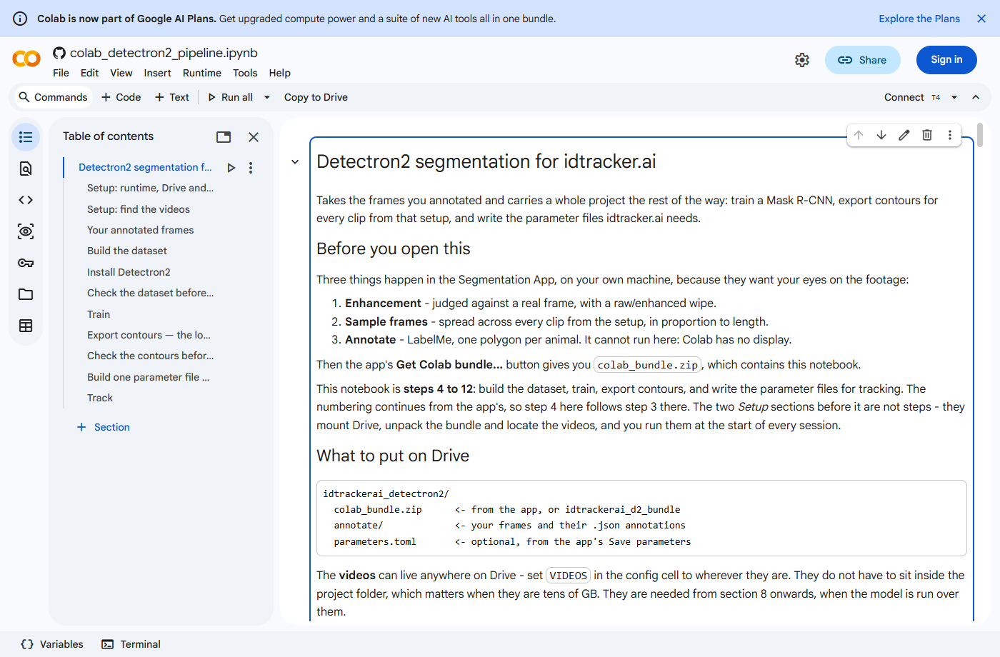

> The screenshots in this section show the notebook as it opens. They do not
> show output, because the runs take hours and could not be captured here.

Set the runtime to a GPU first: **Runtime → Change runtime type → T4**.

**Only one cell needs editing.** It is marked, and everything else reads from
it:

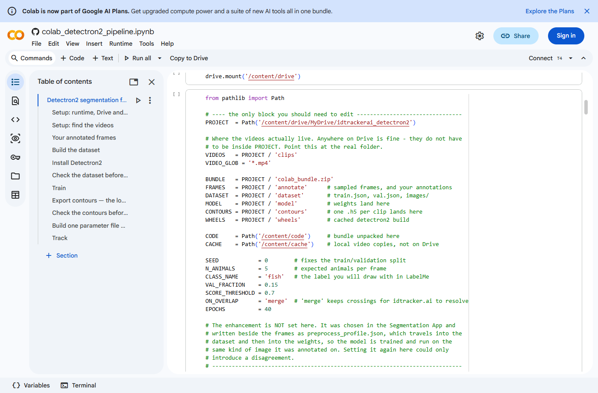

Point `PROJECT` at your Drive folder and `VIDEOS` at wherever the clips are.
Note what is *absent*: the enhancement is not set here, because it travelled
with your frames and setting it again could only introduce a disagreement.

Then work down the sections.

**Building the dataset** converts your polygons to the format the model wants
and splits them into a training set and a validation set, by recording, for
the reason given above. It prints the grouping it inferred before acting on
it — read that the same way you would read it in the app.

**Training** takes about an hour.

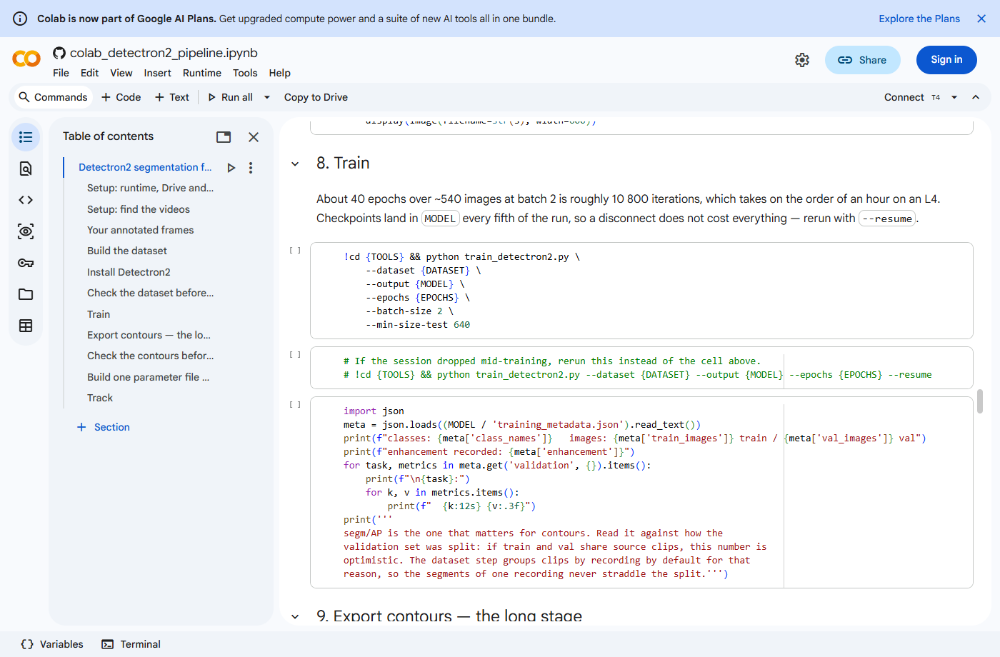

Afterwards, look at `segm/AP` on the validation set. It is a score out of 1 for
how well the predicted outlines match the drawn ones. Read it against the split
above: if train and validation shared clips, the number flatters the model.

**Exporting contours** runs the model over every frame of every clip, and it is
the long one — roughly an hour per 30,000-frame clip, so days for a collection.

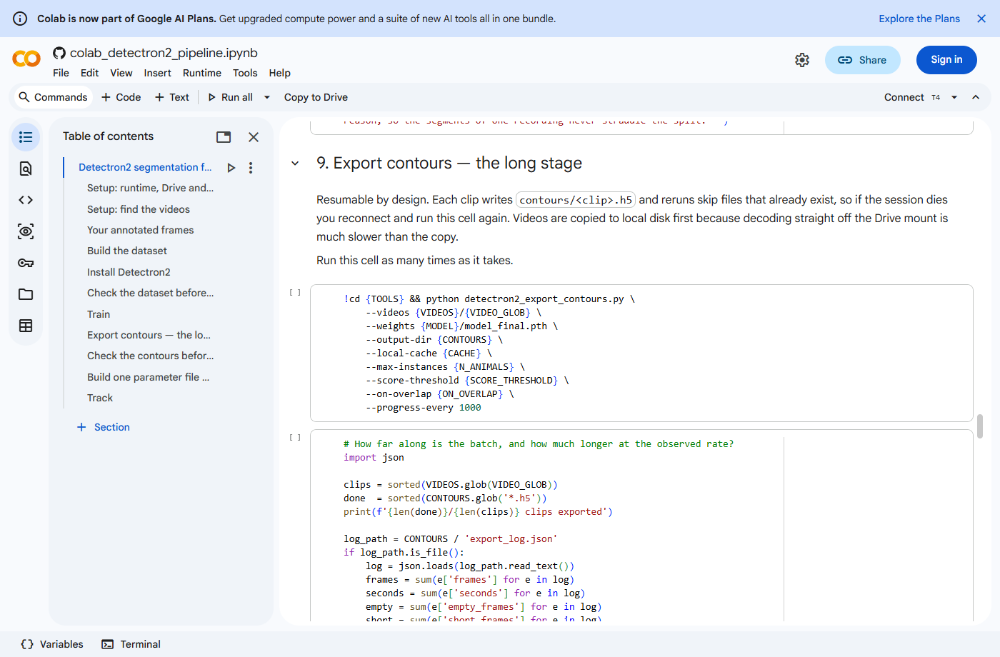

**It cannot finish in one Colab session, and it is not supposed to.** Each clip
writes its own file and re-runs skip clips already done, so reconnect and run
the cell again as many times as it takes.

The notebook ends by writing one parameter file per recording, ready for
tracking.

---

## 8. Tracking with the contours

Download the `contours/` folder — the files are small, tens of megabytes each,
not the gigabytes a re-encoded video would be.

In the app, set **Segmentation** to **External contours** and load them.

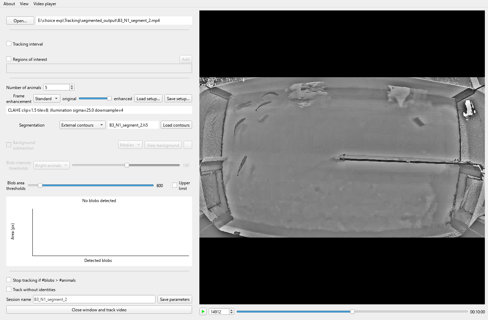

*That screenshot was taken with an empty placeholder file, which is why it
reports no blobs. With real contours the histogram fills as usual.*

The intensity thresholds and background subtraction grey out, because they take
no part any more. Everything after segmentation runs exactly as before.

**If your recording is split into several clips, load one contour file per
clip.** The app pairs them to the videos by name, so the order cannot be wrong,
and the clips are then tracked as **one session** — which means identities
carry across the joins instead of restarting at each segment. Point it at the
folder and it does the matching itself; if any clip has no file, it says which
rather than tracking half your recording.

> Track the same video files the contours were made from. The app checks the
> frame count and resolution and refuses a mismatch, so a re-encoded copy is
> rejected rather than silently misaligned.

---

## 9. Checking the result

**No tracker is right first time, and believing one is the most expensive
mistake available.** Open the Validator:

```bash
idtrackerai_validate
```

It lists the places the tracker was unsure — identities that vanish, impossible
jumps, crossings it could not resolve — and lets you correct them by hand. Work
down the list, fix what is wrong, and save.

This fork changes the Validator substantially: undo, an autosave, three extra
editing operations, and filters that keep the error list workable on long
recordings. All of it is in [VALIDATOR.md](VALIDATOR.md).

Your trajectories end up in the session folder beside the video, in your choice
of CSV, HDF5, NumPy or Parquet. Upstream documents the layout in
[output_structure.rst](docs/source/user_guide/output_structure.rst).

---

## 10. When something goes wrong

**"More blobs than animals!"** — thresholding is finding things that are not
animals. Raise the minimum area first; if that does not fix it, section 5 is
about you.

**Every clip must have a contour file.** If the app says some do not, the
export did not finish. Re-run the export cell; it skips what it has already
done.

**A frame-count or resolution mismatch** means the contours were computed from
a different file to the one you are tracking — usually a re-encoded or
re-exported copy. Track the original.

**Some clips get no frames when sampling.** The frame count is lower than the
number of clips, so the budget ran out. Raise it to at least one per clip.

**Detectron2 will not build.** It needs a C++ compiler and a CUDA toolkit
matching your PyTorch, and it has had no release since 2021 — on recent Python
versions the build can simply fail. `idtrackerai_d2_install_gpu` works out what
your machine needs and shows you the commands before running them. If it still
fails, use Colab, where it is known to work.

**Tracking is slow and your GPU is idle.** PyTorch is a CPU build. Reinstall it
from pytorch.org's index, as in section 3.

---

## Where to go next

- [docs/detectron2-pipeline.md](docs/detectron2-pipeline.md) — the pipeline in
  detail; its *Things worth knowing* section is worth reading before you commit
  days of GPU time
- [VALIDATOR.md](VALIDATOR.md) — everything this fork changed in the Validator
- [idtracker.ai](https://idtracker.ai) — upstream's documentation, for
  everything this fork did not change
- The [eLife paper](https://doi.org/10.7554/eLife.107602) — how the
  identification algorithm actually works

If something in this guide is wrong or unclear,
[open an issue](https://github.com/mbel-tech/idtrackerai-detectron2/issues).
Please do not send problems with this fork to the upstream project.
